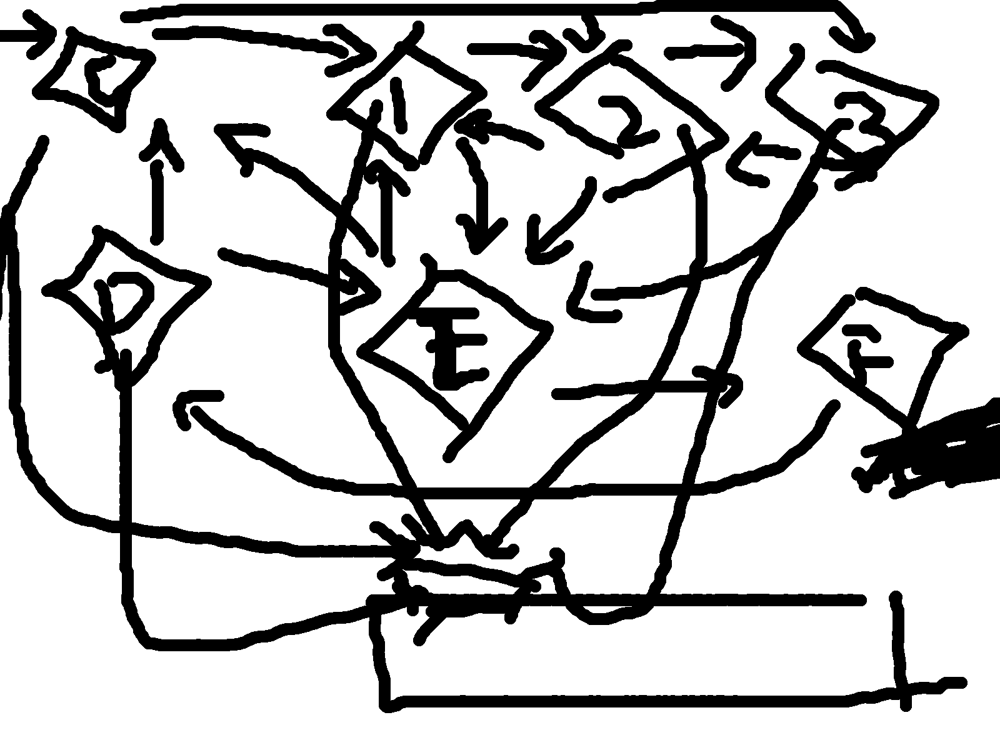

#### 由任意节点F开始输入

#### 

#### nodeFin设置非0

#### Checkalive输入检测，查看所有节点in，有数据执行运算

#### 输出检测，显示被激活区域，查看所有节点out，显示最大out对应的节点

#### room中有cell，每一个cell有in，out，self三个文件

#### in表示接受的输入，self存储从各个节点接受输入的系数

#### out表示从接受的输入整理的输出